# Google Cloud Platform - GCP

  - [Create an Account](#create-an-account)
  - [Setting a Cloud Budget](#setting-a-cloud-budget)
  - [Choose a Terminal](#choose-a-terminal)
    - [Use a Web Based Terminal](#use-a-web-based-terminal)
    - [Use Your Own Computer’s Terminal](#use-your-own-computers-terminal)
  - [Configuring Default Settings for GCP](#configuring-default-settings-for-gcp)
  - [Google Container Registry](#google-container-registry)
    - [Create a Project](#create-a-project)
    - [Push Docker Image on GCP](#push-docker-image-on-gcp)
    - [Build & Run a Container in GCP ](#build--run-a-container-in-gcp-)
      - [Using Cloud Run](#using-cloud-run)
      - [Using GKE (Google Kubernetes Engine)](#using-gke-google-kubernetes-engine)
  - [Tutorials](#tutorials)
  - [GCP Cheat Sheet](#gcp-cheat-sheet)

## Create an Account

Link: https://cloud.google.com/free/

Documentation of the whole process - Free Trial, End of Free Trial, Credit Cards etc. -> https://cloud.google.com/free/docs/gcp-free-tier

**Some important facts:**

* for the first 12 Months $300 free credit with any GCP (Google Cloud Platform) product
    * You must provide credit card or bank details to set up a billing account to verify your identity, but you won't be charged during the free trial.

    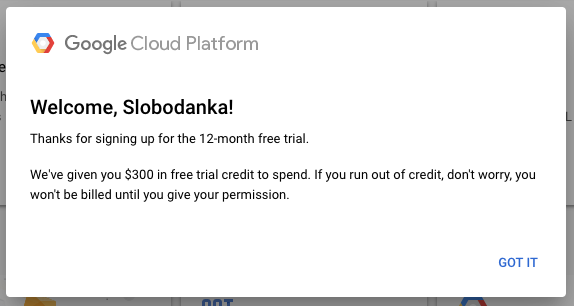

    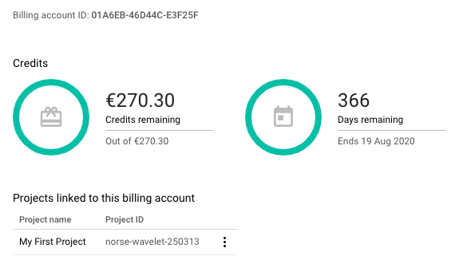

* Education Offers - Google offers the possibility to get additional credits - https://edu.google.com/programs/credits/?modal_active=none
* Always free products
    * Clusters - All size clusters - [Google Kubernetes Engine](https://cloud.google.com/kubernetes-engine/)
        * One-click container orchestration via Kubernetes clusters, managed by Google.
        * No cluster management fee for clusters of all sizes
        * Each user node is charged at standard Compute Engine pricing
    * 50 GB - [Stackdriver](https://cloud.google.com/stackdriver/)
        * Logs with 30-day retention
        * Monitoring, logging, and diagnostics for applications on Cloud Platform and AWS.
        * 50 GB of logs with 30-day retention read access API
        * Basic email alerting
    * AI & Machine Learning
        * Vision AI - 1000 Units/ month
        * Speech-to-Text - 60 min/month
        * Natural language - 5000 Units/month
    * Collection of quickstart tutorials
    * Google Cloud Community

## Setting a Cloud Budget

Consider setting a [cloud budget](https://cloud.google.com/billing/docs/how-to/budgets) for your Google Cloud account in order to make sure you don’t accidentally spend more than you wish to. You should be carefull also with your play-money (the $300).

## Choose a Terminal

You can choose either to use a web based terminal or install and run the required command line interfaces on your own computer’s terminal. There is no recommended terminal, you should use what you feel more comfortable with in a special situation. Below are both sets of instructions.

### Use a Web Based Terminal
Start Google Cloud Shell from the [GCP Console](https://console.cloud.google.com/) by clicking the button shown below. You are now in control of a virtual machine with various tools preinstalled. If you save something in a user folder they will remain available to you if you return at a later stage. Additional documentation about Google Cloud shell is available [here](https://cloud.google.com/shell/docs/).

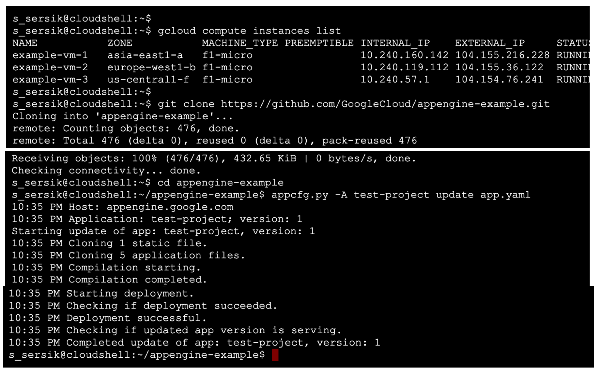

### Use Your Own Computer’s Terminal

1. Download and install the **gcloud** command line tool at its [install page](https://cloud.google.com/sdk/install). It will help you create and communicate with the Container Registry, Build Engine, Container Engine and Kubernetes cluster.
2. Install **kubectl** (reads kube control), it is a tool for controlling Kubernetes clusters in general. From your terminal, enter:

~~~
    gcloud components install kubectl
~~~

## Configuring Default Settings for GCP

Configuring default settings makes it easier to run gcloud commands, since gcloud requires that you specify the project and compute zone in which you wish to work. You can also specify these settings or override default settings by passing operational flags, such as --project, --zone, and --cluster, to gcloud commands.

When you create GKE resources after configuring your default project and compute zone, the resources are automatically created in that project and zone.

Link: https://cloud.google.com/sdk/gcloud/reference/config/set

## Google Container Registry

### Create a Project

1. In the GCP Console (https://console.cloud.google.com/projectselector2/home/dashboard), on the project selector page, select or create a GCP project.
  
  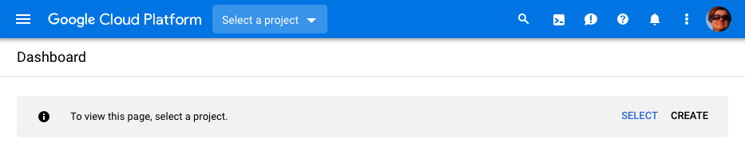

2. Give the project a name - e.g. hands-on-helloworld
  
  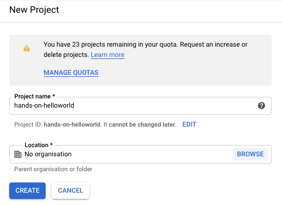

3. You should be able to see your project dashboard

  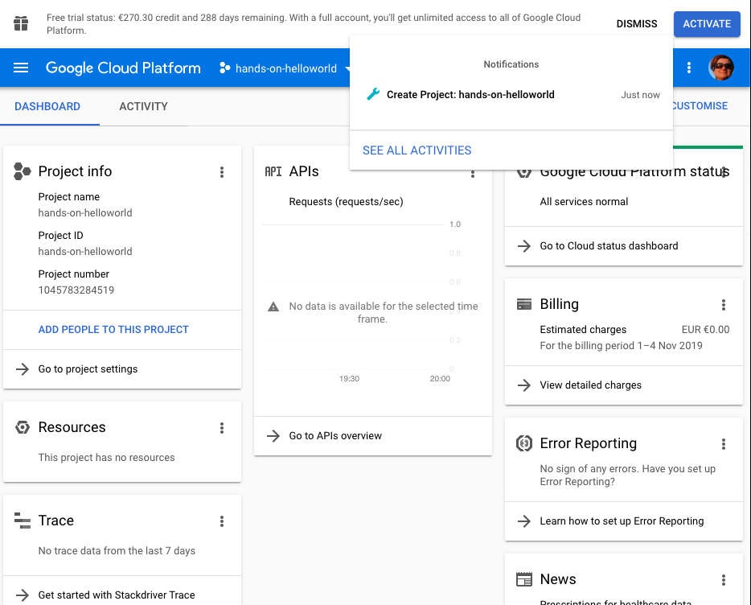

### Push Docker Image on GCP

If you already have a docker image that you would like to reuse, you can push it to the GCP Container Registry using following steps.

1. Setup the registry, as in the following guide https://cloud.google.com/container-registry/docs/quickstart
2. Tag your image with the gcloud information

  ~~~
    docker images (-> shows you all the images)
    docker tag [SOURCE_IMAGE] [HOSTNAME]/[PROJECT-ID]/[IMAGE]
      e.g. docker tag 2c5ce5dc96ea gcr.io/hands-on-helloworld/helloworld-python-app
    docker images (-> shows you the helloworld-python-app image twice with 2 different tags)    
  ~~~
	
3. Push the tagged image to Container Registry

  ~~~
    docker push [HOSTNAME]/[PROJECT-ID]/[IMAGE]
      e.g. docker push gcr.io/hands-on-helloworld/helloworld-python-app
  ~~~

4. You should be able to see your new image in the Containr registry (https://console.cloud.google.com/gcr/images/hands-on-helloworld?project=hands-on-helloworld)

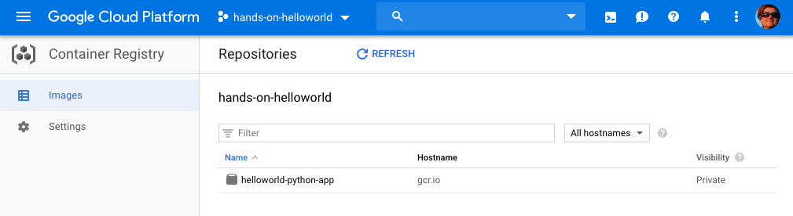

### Build & Run a Container in GCP 

In GCP yuo have the choice to run your Container:

1. either fully managed in Cloud Run
2. or in your Kubernetes Engine cluster

#### Using Cloud Run

1. Go to Cloud Run: https://console.cloud.google.com/marketplace/details/google-cloud-platform/cloud-run?project=hands-on-helloworld
2. Choose "Start using Cloud Run"

   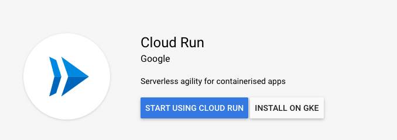

3. Click on "Create Service"

   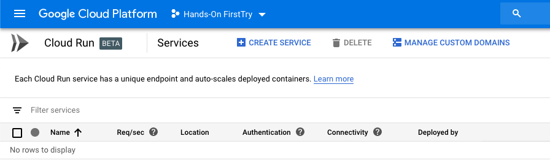

4. Choose the container image using the "SELECT" link and choose "Allow unauthenticated invocations", the rest can be left as per default.

   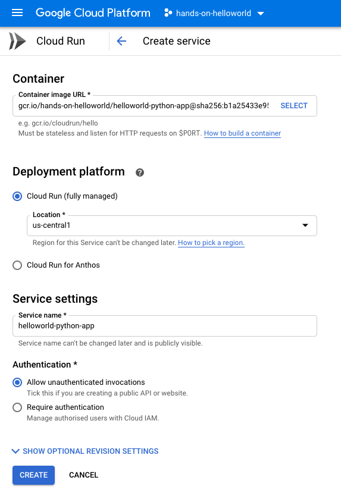

5. The service creation might take couple of minutes, and once created you should be able to see your deployed container running in the Google Cloud

   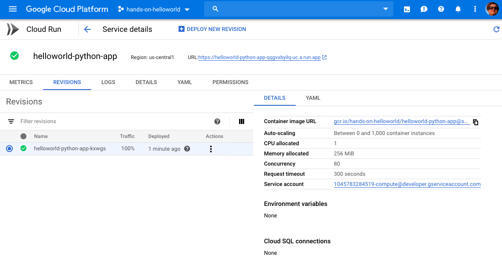

6. You can click on the Container URL and should be able to see your "Hello World" application.

#### Using GKE (Google Kubernetes Engine)

_TODO_

## Tutorials
* Coursera GCP Fundamentals: https://www.coursera.org/lecture/gcp-fundamentals/welcome-to-gcp-fundamentals-I6zpd
* Google Cloud Platform Collection of tutorials: https://cloud.google.com/docs/tutorials
* Quick Start for Containers: https://cloud.google.com/cloud-build/docs/quickstart-docker

## GCP Cheat Sheet

- [Google Developers Console Home](https://console.cloud.google.com/cloud-resource-manager)
- [Google Container Registry](https://console.cloud.google.com/gcr/images/hands-on-firsttry)
- [Google Cloud Builds](https://console.cloud.google.com/cloud-build/builds)
- [Google Cloud Run](https://console.cloud.google.com/run)

