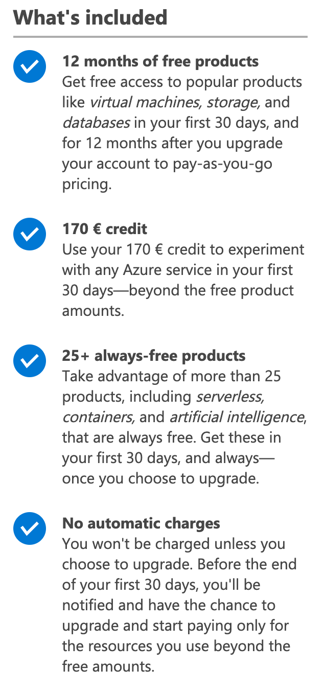
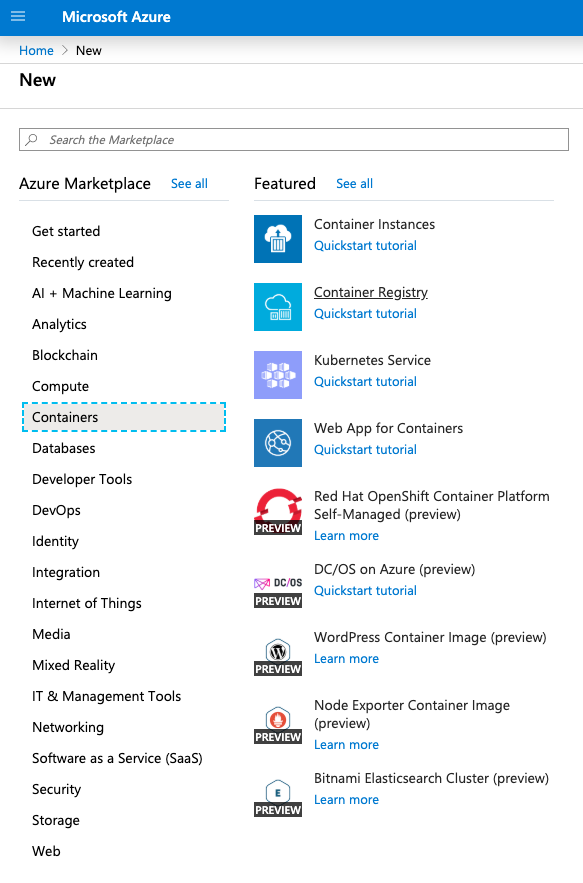
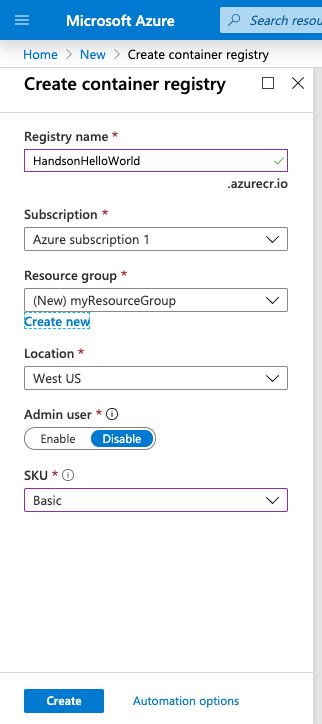
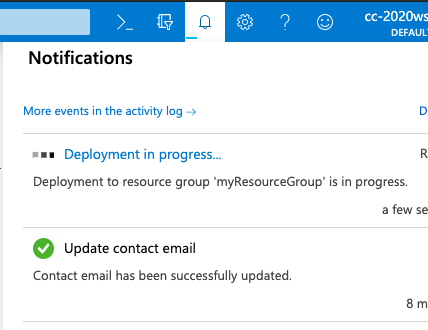
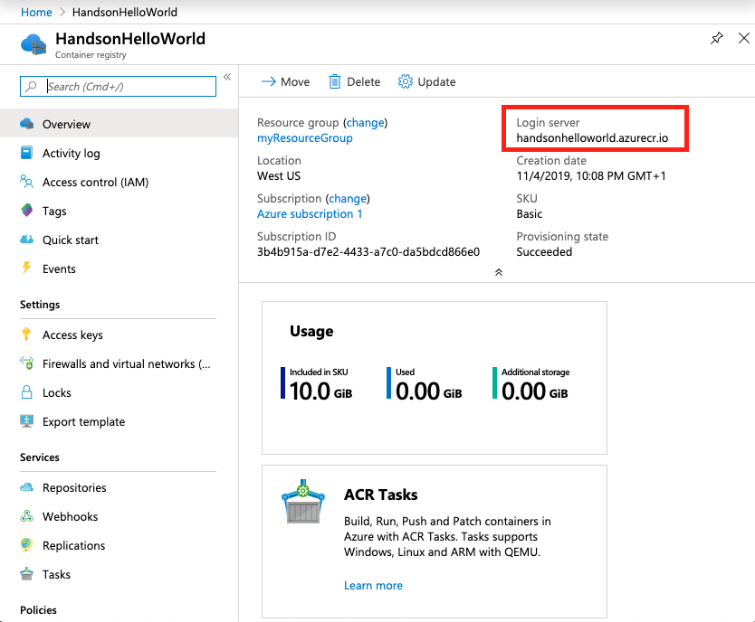
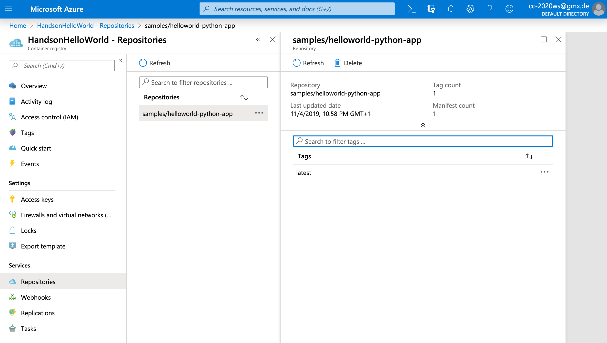
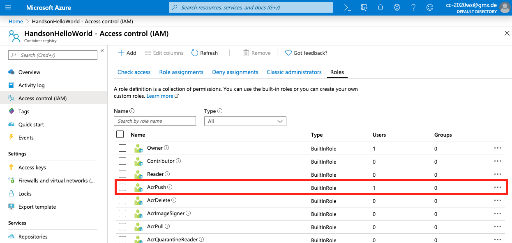
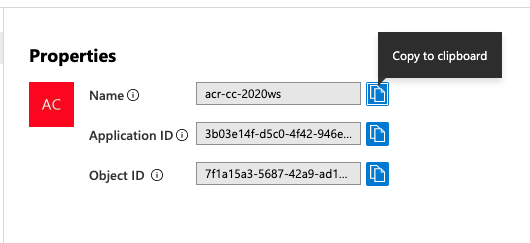
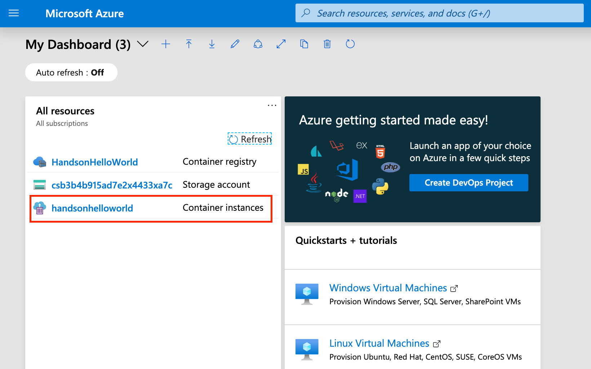

# Microsoft Azure

  - [Create an Account](#create-an-account)
  - [Choose a Terminal](#choose-a-terminal)
    - [Use a Web Based Terminal](#use-a-web-based-terminal)
    - [Use Your Own Computer’s Terminal](#use-your-own-computers-terminal)
  - [MS Azure Container Engine](#ms-azure-container-engine)
    - [Create Registry and Access to it](#create-registry-and-access-to-it)
    - [Push Docker Image on ACR](#push-docker-image-on-acr)
    - [Build & Run a Container on MS Azure ](#build--run-a-container-on-ms-azure-)
      - [Using Azure Container Instances](#using-azure-container-instances)
      - [Using Azure Kubernetes Service](#using-azure-kubernetes-service)
  - [Tutorials](#tutorials)
  - [Cheat Sheet](#cheat-sheet)

## Create an Account

Link for everybody: https://azure.microsoft.com/en-us/free/

* $200 credit to explore any Azure service for 30 days
* 12 months of popular free services

Link for students: https://azure.microsoft.com/en-us/free/students/

* Get a $100 credit when you create your free Azure for Students account

**Some important facts:**

* You must provide credit card or bank details to set up a billing account to verify your identity, but you won't be charged during the free trial.

    

* Possibility to schedule a live demo to see Azure in action
* Microsoft-Like Tour through the portal
* Many free services for 12 months or some even longer: https://azure.microsoft.com/en-us/free/free-account-faq/ - some examples:
    * 128 GB of Managed Disks as a combination of two 64 GB (P6) SSD storage
    * 5 GB of LRS File Storage with 2 million read, 2 million list, and 2 million other file operations
    * 1 million requests and 400,000 GBs of resource consumption with Azure Functions
    * First 5 users free with Azure DevOps
    * Free Azure Container service to cluster virtual machines
    * First 5 users free with Azure DevOps

## Choose a Terminal
You can choose either to use a web based terminal or install and run the required command line interfaces on your own computer’s terminal. There is no recommended terminal, you should use what you feel more comfortable with in a special situation. Below are both sets of instructions.

### Use a Web Based Terminal
Azure hosts Azure Cloud Shell, an interactive shell environment that you can use through your browser. Cloud Shell lets you use either bash or PowerShell to work with Azure services. You can use the Cloud Shell pre-installed commands to run the code in this article without having to install anything on your local environment.

To launch Azure Cloud Shell there are 2 Options:

1. Go to [https://shell.azure.com](https://shell.azure.com) or select the Launch Cloud Shell button to open Cloud Shell in your browser.

    

2. Select the Cloud Shell button on the top-right menu bar in the [Azure portal](https://portal.azure.com/).

    

### Use Your Own Computer’s Terminal
You can also a local installation of the Azure CLI. If you'd like to use it locally, version 2.0.55 or later is recommended. Run az --version to find the version. If you need to install or upgrade, see [Install Azure CLI](https://docs.microsoft.com/en-us/cli/azure/install-azure-cli).

## MS Azure Container Engine
Create a container registry in your Azure subscription. For example, use the Azure portal as explained below or the [Azure CLI](https://docs.microsoft.com/bs-latn-ba/azure/container-registry/container-registry-get-started-azure-cli).

### Create Registry and Access to it

1. Sign in to the Azure portal at https://portal.azure.com
2. Select Create a resource > Containers > Container Registry.

    
    
3. Enter values for Registry name and Resource group. The registry name must be unique within Azure, and contain 5-50 alphanumeric characters. For this quickstart create a new resource group in the West US location named myResourceGroup, and for SKU, select 'Basic'. Select Create to deploy the ACR instance (Basic registry = a cost-optimized option for developers learning about Azure Container Registry).

    

4. During the Registry Creation you will see a blinking notification

    

5. When the Deployment succeeded message appears, select the container registry in the portal. Take note of the value of the Login server. You use this value in the following steps while working with your registry.

    

6. You'll have to authenticate to your private container registry. There are several ways to authenticate. The recommended method when working in a command line is with the Azure CLI command.
  
  * First you need to Login to your Azure account. Following command will forward you to your browser. If the CLI can open your default browser, it will do so and load an Azure sign-in page. Otherwise, open a browser page at https://aka.ms/devicelogin and enter the authorization code displayed in your terminal.
  
      ~~~
      az login
      ~~~

  *  Now you can login to your Container Registry

      ~~~
      az acr login --name handsonhelloworld
      ~~~
  
  * You shoud receive a "Login Succeeded" once completed.

### Push Docker Image on ACR

1. Tag your image with the gcloud information

  ~~~
    docker images (-> shows you all the images)
    docker tag [SOURCE_IMAGE] [HOSTNAME]/[PROJECT-ID]/[IMAGE]
      e.g. docker tag 2c5ce5dc96ea handsonhelloworld.azurecr.io/samples/helloworld-python-app
    docker images (-> shows you the helloworld-python-app image twice with 2 different tags)    
  ~~~
	
2. Push the tagged image to Container Registry

  ~~~
    docker push [HOSTNAME]/[PROJECT-ID]/[IMAGE]
      e.g. docker push handsonhelloworld.azurecr.io/samples/helloworld-python-app
  ~~~

3. You should be able to see your new image in the Container registry 

  * Check using the Azure CLI
  
      ~~~
      az acr repository show-tags --name handsonhelloworld --repository samples/helloworld-python-app --output table
      ~~~

  * Check using the Portal

      

### Build & Run a Container on MS Azure 

In MS Azure you have the choice to deploy your container images to:

1. either Azure Container Instances
2. or in the Azure Kubernetes Service

#### Using Azure Container Instances
1. Create a service principle (Details: https://docs.microsoft.com/en-us/azure/container-registry/container-registry-auth-aci). In the console execute following Azure CLI commands. 

2. Make following changes (the rest can be used as-is)
	* set ACR_NAME
	* set SERVICE_PRINCIPAL_NAME

  ~~~
  #!/bin/bash

  # Modify for your environment.
  # ACR_NAME: The name of your Azure Container Registry
  # SERVICE_PRINCIPAL_NAME: Must be unique within your AD tenant
  ACR_NAME=<container-registry-name>
  SERVICE_PRINCIPAL_NAME=acr-service-principal

  # Obtain the full registry ID for subsequent command args
  ACR_REGISTRY_ID=$(az acr show --name $ACR_NAME --query id --output tsv)

  # Create the service principal with rights scoped to the registry.
  # Default permissions are for docker pull access. Modify the '--role'
  # argument value as desired:
  # acrpull:     pull only
  # acrpush:     push and pull
  # owner:       push, pull, and assign roles
  SP_PASSWD=$(az ad sp create-for-rbac --name http://$SERVICE_PRINCIPAL_NAME --scopes $ACR_REGISTRY_ID --role acrpush --query password --output tsv)
  SP_APP_ID=$(az ad sp show --id http://$SERVICE_PRINCIPAL_NAME --query appId --output tsv)

  # Output the service principal's credentials; use these in your services and
  # applications to authenticate to the container registry.
  echo "Service principal ID: $SP_APP_ID"
  echo "Service principal password: $SP_PASSWD"
  ~~~

  After you run the script, take note of the service principal's ID and password. Once you have its credentials, you can configure your applications and services to authenticate to your container registry as the service principal.
  
  You can also check the user ID using the Azure Portal: Access Control (IAM) > Roles > AcrPush
  
  

  

3. Create the container instance - use the "az container create" command to deploy the container. Replace <acrLoginServerName> and <acrLoginServer> with the name of your login server. Replace <service-principal-ID> and <service-principal-password> with the service principal ID and password that you created to access the registry. Replace <aciDnsLabel> with a desired DNS name.

    ~~~
    az container create 
      --resource-group myResourceGroup 
      --name <acrLoginServerName> 
      --image <acrLoginServer>/samples/helloworld-python-app:v1 
      --cpu 1 
      --memory 1 
      --registry-login-server <acrLoginServer> 
      --registry-username <service-principal-ID> 
      --registry-password <service-principal-password> 
      --dns-name-label <aciDnsLabel> 
      --ports 80
    
    e.g.
    az container create 
      --resource-group myResourceGroup 
      --name handsonhelloworld 
      --image handsonhelloworld.azurecr.io/samples/helloworld-python-app:latest 
      --cpu 1 
      --memory 1 
      --registry-login-server handsonhelloworld.azurecr.io 
      --registry-username 3b03e14f-d5c0-4f42-946e-ba7508617cb6 
      --registry-password 22be63cc-81fe-4c03-a65b-609e0d99542d 
      --dns-name-label msazure-helloworld-python-app 
      --ports 80
    ~~~

4. Check if your container runs

    ~~~
    az container show --resource-group myResourceGroup --name handsonhelloworld --query instanceView.state
    -> should return "Running"

    az container show --resource-group myResourceGroup --name handsonhelloworld --query ipAddress.fqdn
    -> should return the URL of your running container
    ~~~

    You should be able to see your container instance now also in your MS Azure Dashboard.
    
    

5. Click on the name of your Container Instance and explore what MS Azure offers to maintain and monitor it.

#### Using Azure Kubernetes Service

_TODO_

## Tutorials
* Microsoft Azure Tutorial for Beginners (contains good overview of the Azure concepts): https://www.guru99.com/microsoft-azure-tutorial.html
* Microsoft Azure Collection of tutorials: https://docs.microsoft.com/en-us/learn/paths/azure-fundamentals/
* Quick Start for Containers: https://docs.microsoft.com/en-us/azure/container-instances/container-instances-quickstart

## Cheat Sheet
* [Cloud Shell](https://shell.azure.com) 
* [Container Registry](https://portal.azure.com/#create/Microsoft.ContainerRegistry)

